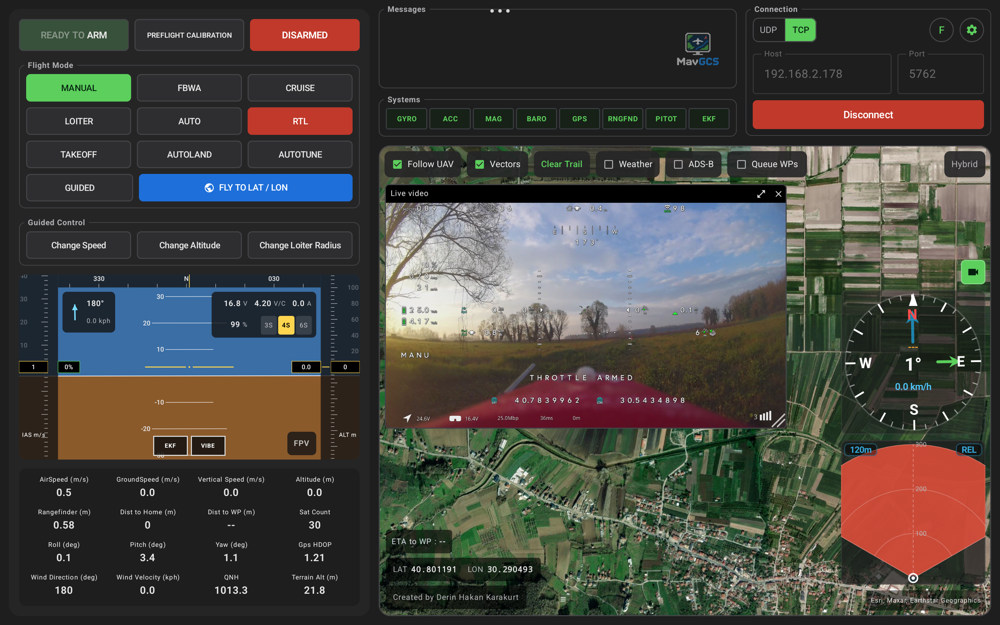

## 
Ground Control Station for ArduPilot & PX4, INAV.

 
 
 

  

A ground control station software for **MAVLink** protocol. 🛩️

It works with **Ardupilot**, **PX4** (Bi-directional) or **INAV** (Uni-directional).

Supports MAVLink over ELRS and LTE telemetry.

You can monitor HUD and vital information about flight, use weather radar, experience 3D FPV view, see the vehicle on the moving map, view terrain radar, execute instant waypoint missions, and more.

You need to get free token from [ion.cesium.com](http://ion.cesium.com/) to activate 3D FPV view.

This app is optimized for 12.7" Android tablets.

Created by **Derin Hakan Karakurt**

### Installing & Running MavGCS (Android)

Download `MavGCS-<version>.apk` from the
[Releases page](https://github.com/kolabuzlu/MavGCS-Android/releases), install it, run the app.
